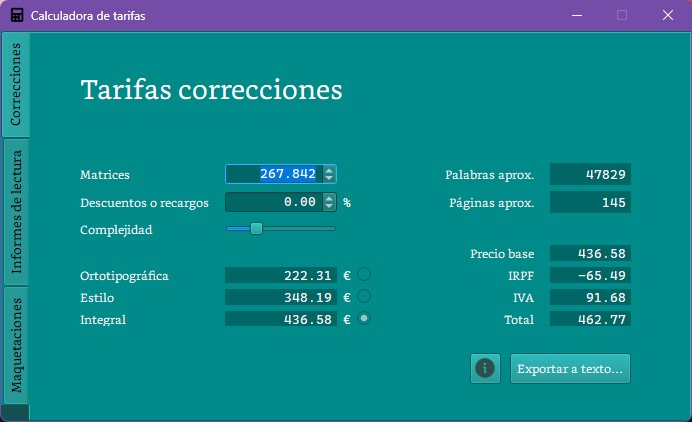
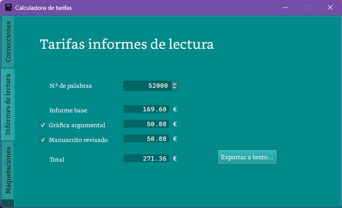
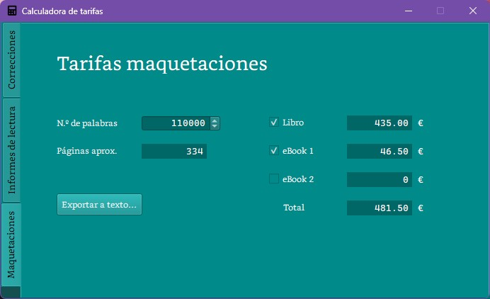

# RateCalculator

**Herramienta para elaborar presupuestos profesionales**.

Esta es la aplicación que desarrollé para elaborar los presupuestos de corrección, maquetación e informes de lectura para editoriales y clientes particulares en 2022. 

Hecha con QtPy y Python.

## Funcionalidades

En la mayoría de situaciones, el cálculo de los precios no se basa en una regla fija. Por ejemplo, la aplicación tiene en cuenta si los textos a corregir son breves o extensos en función del número de caracteres. Sucede algo similar con los informes de lectura, cuyo valor por página disminuye de forma gradual cuanto mayor sea la extensión.

### Corrección

Según el número de matrices (o caracteres con espacios incluidos), la aplicación calcula el precio según el tipo de corrección y otros factores como la complejidad del texto o si existen descuentos o recargos. Además, a efectos informativos, calcula también el número aproximado de palabras y páginas que tendrá el documento.

Tras elegir el tipo de corrección, la aplicación proporciona los datos para la facturación, que pueden exportarse a un archivo de texto .txt.

### Informes de lectura

En este caso, el valor a introducir es el número de palabras del manuscrito. La aplicación determinará el precio, tanto si es el servicio base como si se solicita algún extra. 

### Maquetación

Según el número de palabras, la aplicación calcula el número de páginas aproximado del libro a maquetar. A partir de este valor, se calcula el precio de la edición física y de los posibles extras. 

---

## Demo
[Vídeo](imgs/calc_qt_demo.mkv)

---

**Tool to make professional budgets**.

This is the desktop app I developed to prepare proofreading, layout and reading reports budgets for publishers and private clients in 2022.

Made with QtPy and Python.

## Features

In most situations, price calculation is not based on a fixed rule. For example, the app takes into account whether the texts to be corrected are short or long depending on the number of characters. Something similar happens with reading reports, whose value per page gradually decreases the longer the length.

### Correction

Depending on the number of characters with spaces included, the app calculates the price based on the type of correction and other factors such as the complexity of the text or whether there are discounts or surcharges. Additionally, for information purposes, it also calculates the approximate number of words and pages that the document will have.

After choosing the type of proofreading, the application provides the data for billing, which can be exported to a .txt text file.

### Reading reports

In this case, the value to enter is the number of words in the manuscript. The application will determine the price, whether it is the base service or if any extra is requested.

### Layout

Based on the number of words, the application calculates the approximate number of pages of the book to be laid out. From this value, the price of the physical edition and possible extras is calculated.

